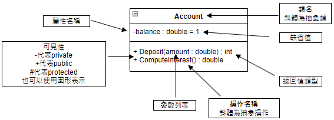
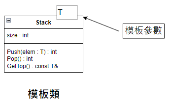

**UML之靜態圖---類圖、對象圖(class diagram)**(README.md)
-------------------------
在學習類圖之前我們要先了解一下類，對象的概念。

**①、什么是类？什么是对象？他们的关系是什么？**

类：类是具有相同属性和服务的一组对象的集合。为属于该类的所有对象提供了统一的抽象描述，其内部包括属性和服务（方法）两个主要部分。

对象：对象是系统中用来描述客观事物的一个实体，是构成系统的一个基本单位。一个对象由一组属性和这组属性进行操作的一组服务组成。从更抽象的角度来讲，对象是 问题域或实现域中某些事物的一个抽象，她反应该事物在系统中需要保存的信息和发挥的作用；它是一组属性和有权对这些属性进行操作的一组服务的封装体。客观世界是 由对象和对象之间的联系组成的。

类与对象的关系就如磨具与铸件的关系，类的实例化结果就是对象，而对一类对象的抽象就是类。类描述了一组有相同特征（属性）和形同行为（方法）的对象。

**②、什么是类图？**

类图一反应类的结构（属性、操作）以及类之间的关系为主要目的，描述了软件系统的结构，是一中静态建模方法。

类图中的“类”与面向对象语言中的“类”的概念是对应的，是对现实世界中事物的抽象。

**③、用例图后面为什么是画类图，而不是其他图，类图产生于什么阶段，由谁来绘制，类图它的作用是什么？**
--------------------
因为按照软件工程的生命周期来运行的话，需求分析阶段后便是设计阶段了，而类图产生于设计阶段，由系统设计师绘制，其作用是描述系统的架构结构、指导程序员编 码。它包括系统中所有有必要指明的实体类、控制类、界面类及与具体平台有关的所有技术性信息。

**④、类图可分为哪两类？**
-------------
[http://developer.51cto.com/art/201007/210700.htm](http://developer.51cto.com/art/201007/210700.htm)

**⑤、站在巨人的肩膀上了解类图（很棒的一篇文章）**
---------------------
[https://blog.csdn.net/monkey_d_meng/article/details/6005764](https://blog.csdn.net/monkey_d_meng/article/details/6005764)

**⑥、UML类图如何绘制？**

**6.1、类的表示**

**6.1.1、类的组成**
------------

从上到下分为三部分，分别是类名、属性和操作。

**6.1.2、接口**
----------------

一组操作的集合，只有操作的声明而没有实现。接口图与类图的主要区别在于顶端的<<interface>>显示。
第一行是接口名称，第二行是接口方法。接口还有另一种表示方法，俗称棒棒糖表示方法。
唐老鸭是能讲人话的唐老鸭，实现了讲人话的接口。如图：

**6.1.3、抽象类**
-----------------

不能被实例化的类，一般至少包含一个抽象操作，与类图的主要区别在于抽象类的名称、方法为斜体。

**6.1.4、模板类**
----------------------

一种参数化的类，在编译时把模板参数绑定到不同的数据类型，从而产生不同的类。

**6.2、类的关系**

------------------

描述了类的结构之间的关系，具有方向、名字、角色和多重性等信息。

一般的关联关系语义较弱，也有两种语义较强，分别是聚合和组合

**聚合关系：**

---------------------------------------

特殊关联关系，指明一个聚合（整体）和组成部分之间的关系

**组合关系：**
